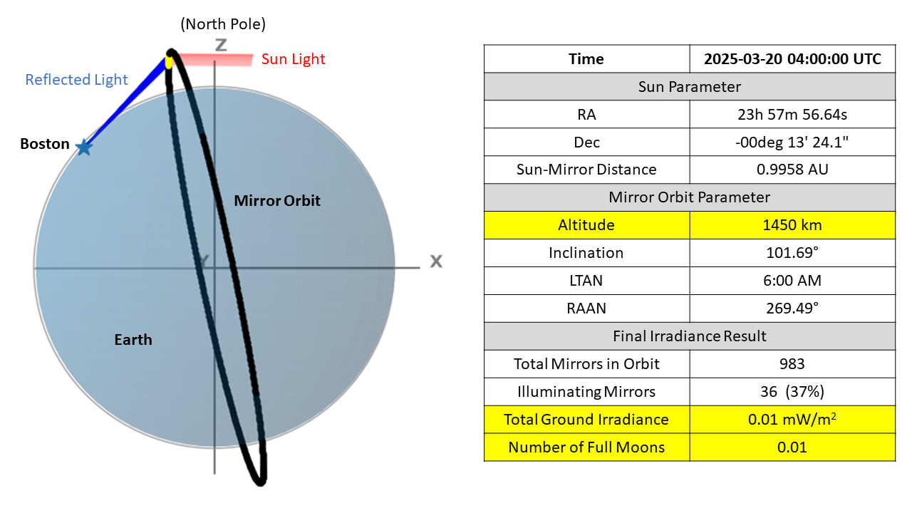
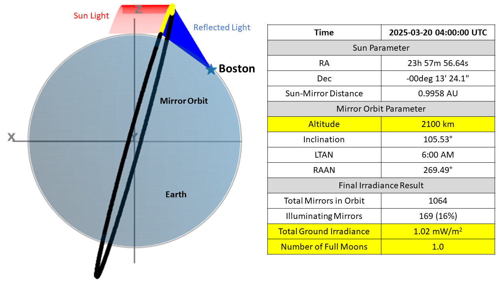
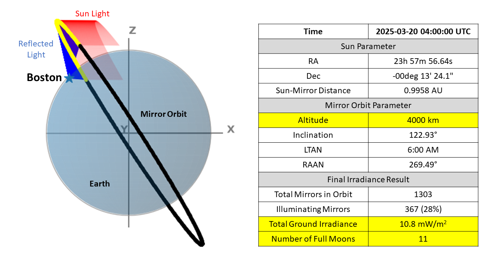

# How Many Space Mirrors Would It Take to Light Up Your Night?

*Figure 1. Sun–Mirror–Earth configuration producing 0.01× full-Moon irradiance at Boston.*

## Introduction

I recently came across a startup company, [Reflect Orbital](https://www.reflectorbital.com/), that wants to put large mirrors into space and use them to reflect sunlight back toward Earth after sunset. The basic idea is to use orbital mirrors to extend sunlight into the night and provide illumination to selected locations on Earth. If you are interested in their vision and planned applications, you can find more details on their website.

I was immediately curious: **is this really possible, and how much light could an orbital mirror actually deliver to the ground?**

I started looking for more information about the technical parameters of the system, particularly the mirror size, orbital altitude, and orbital configuration. However, I could not find enough publicly available information to answer these questions in detail. The one specific number I found is that Reflect Orbital plans to use mirrors approximately 18 meters wide.

<!-- more -->

So I decided to take that number as a starting point and use my background in optics and physics, together with a Python-based simulation, to investigate the problem myself.

In particular, I want to answer a simple but interesting question:

> **What orbit would allow an 18-meter space mirror to illuminate Boston at night, and how many mirrors would be needed to produce approximately the same irradiance as a full Moon?**

To answer this, I will calculate the complete **Sun → mirror → Earth** geometry, including the satellite orbit, sunlight availability, specular reflection, Earth occlusion, mirror projected area, reflected beam size, atmospheric attenuation, and the resulting visible-light irradiance at the ground.

The goal is not to reproduce Reflect Orbital's internal design. Rather, this is an independent physics-based investigation using the limited public information available and the principles of optics and orbital mechanics.

## The Results at a Glance

Before getting into the details of the physics and the Python simulation, let me first show you the final results.

This section is intended as a quick overview of what the simulation finds. I will not explain here how these results were calculated or go through the detailed equations. If you are mainly interested in the answer, you can simply look at the figures and the table below. If you want to understand **how I arrived at these results**, I explained the details in **[this article](https://optical-intelligence.github.io/home/blog/2026/08/22/how-does-a-space-mirror-light-up-the-night-the-physics-behind-the-simulation)**, where I will walk through the orbital geometry, sunlight-to-mirror calculation, mirror-to-Earth reflection, atmospheric attenuation, and final irradiance calculation step by step. The complete Python simulation used to generate the results is available on my **[Gumroad page](https://opticalpython.gumroad.com/l/mirror_sso)**.

The following three figures show the **Sun → Mirror → Earth** geometry for three different dawn-dusk Sun-synchronous orbits at different orbital altitudes. The mirrors are evenly distributed around each orbit, with a spacing of 100 km between adjacent mirrors. The figures also show which mirrors can potentially reflect sunlight toward the selected location on Earth, using Boston as an example. The detailed simulation parameters are included in each figure.

But why choose a **dawn-dusk Sun-synchronous orbit** in the first place?

A Sun-synchronous orbit is designed to maintain a nearly constant orientation with respect to the Sun. In the special dawn-dusk configuration, the orbital plane is approximately aligned with the Earth's day-night terminator, allowing a satellite to remain in sunlight for most or potentially nearly all of its orbit and minimizing periods when the Earth blocks the Sun. This makes it particularly attractive for a satellite whose primary purpose is to collect and reflect sunlight. The European Space Agency provides a good introduction to Sun-synchronous and dawn-dusk orbits [here](https://www.esa.int/Enabling_Support/Space_Transportation/Types_of_orbits).

In this simulation, I therefore use **dawn-dusk Sun-synchronous orbits** as the candidate orbits for the orbital mirrors. The next sections will explain in detail how the orbital geometry is determined and how I calculate whether a particular mirror can actually reflect sunlight to a specific point on Earth.

*Figure 2. Sun–Mirror–Earth configuration producing 1× full-Moon irradiance at Boston.*

*Figure 3. Sun–Mirror–Earth configuration producing 11× full-Moon irradiance at Boston.*

### Summary of the Results

The final irradiance produced by the reflected sunlight at Boston depends strongly on the altitude of the dawn-dusk SSO.

For this particular example, **Mirrors on the SSO orbits below approximately 1,400 km cannot illuminate Boston** because the mirrors are outside Boston's line of sight to the orbit. As the orbital altitude increases, the SSO orbital inclination also changes. This changes the three-dimensional reflection geometry and, in particular, the angle at which the reflected light reaches Boston. The orbital altitude also determines the circumference of the orbit and therefore the total number of mirrors that can be accommodated when a fixed spacing is used.

For example, at an SSO altitude of **2,100 km** (Figure 2), the orbit can accommodate approximately **1,064 mirrors** when the mirrors are spaced **100 km apart**. However, only **169 mirrors**, or approximately **16% of the total constellation**, have the appropriate geometry to reflect sunlight toward Boston at the selected time.

Interestingly, these 169 functional mirrors are sufficient to produce a total irradiance at Boston approximately **equivalent to full-Moon illumination** under the assumptions used in this simulation.

This result illustrates an important point: **the total number of mirrors in the orbit is not the same as the number of mirrors that can illuminate a particular location at a particular time.** Orbital altitude, orbital inclination, Earth visibility, reflection geometry, and mirror spacing all play an important role.

In the next post, I will provide the **Python simulation code and the detailed equations** used to calculate the Sun–mirror–Earth geometry and the resulting ground irradiance.

**Stay tuned!**
