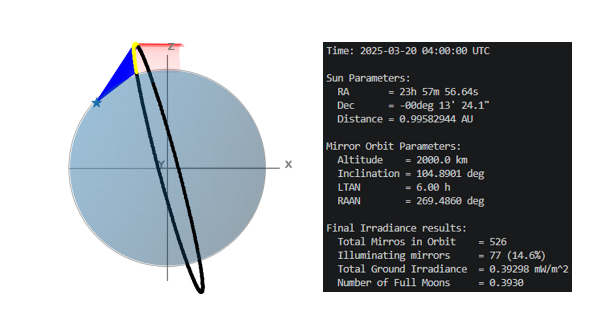
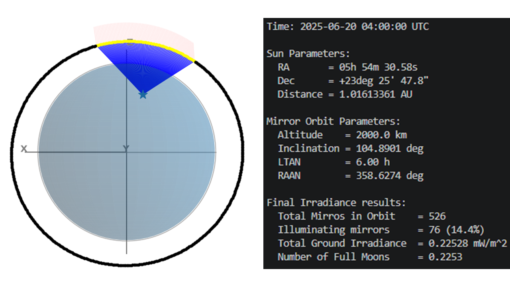
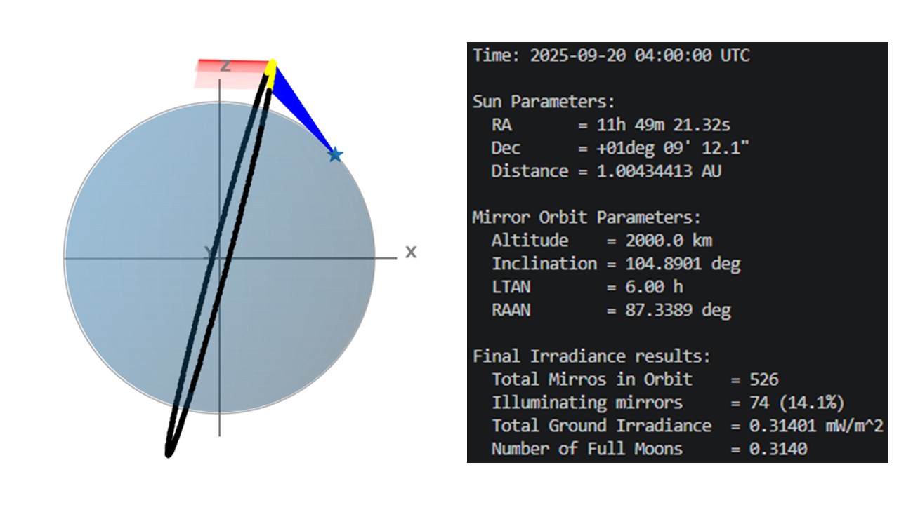
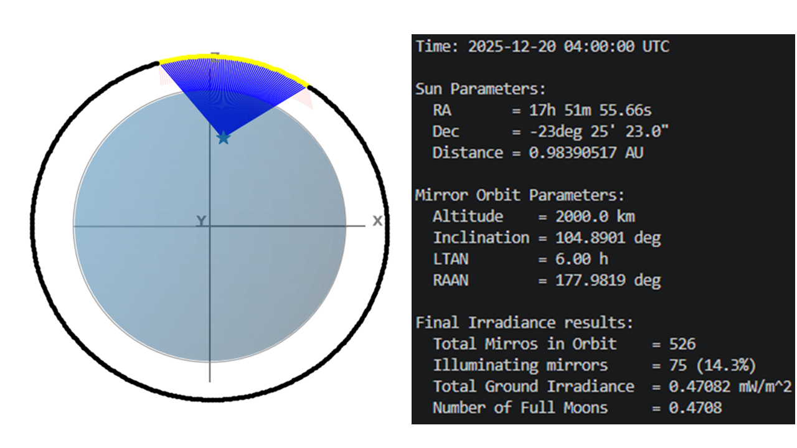

# Simulating a Space-Mirror System with Python: Four Seasons Over Boston

In my previous two posts, I introduced the idea of using a constellation of space mirrors to reflect sunlight toward Earth and explained the basic physics behind the simulation.

* [How Many Space Mirrors Would It Take to Light Up Your Night?](https://optical-intelligence.github.io/home/blog/2026/08/16/how-many-space-mirrors-would-it-take-to-light-up-your-night)
* [How Does a Space Mirror Light Up the Night? The Physics Behind the Simulation](https://optical-intelligence.github.io/home/blog/2026/08/22/how-does-a-space-mirror-light-up-the-night-the-physics-behind-the-simulation)

In this third post, I want to show the **Python simulation code itself** and demonstrate how it can be used to calculate reflected sunlight at Boston during different seasons.

The complete Python code is available on my Gumroad page:

**👉 [Mirror SSO Python Simulation — Gumroad](https://opticalpython.gumroad.com/l/mirror_sso)**

<!-- more -->

---

## The Simulation Setup

For this example, I simulated a dawn-dusk Sun-synchronous orbit (SSO) mirror constellation with:

* **Mirror altitude:** 2,000 km
* **Number of mirrors:** 526
* **Distance between mirrors:** 100 km
* **Mirror size:** 18 m × 18 m
* **Mirror reflectivity:** 90%
* **Ground location:** Boston, Massachusetts
* **Atmospheric transmission:** 80%
* **Local time of the SSO:** 6:00 AM
* **Reference full-moon irradiance:** 1 mW/m²

The simulation was run for four dates in 2025:

| Season | Simulation Date | Reflected Irradiance |
| ------ | --------------- | -------------------: |
| Spring | 2025-03-20      |  **0.40 full moons** |
| Summer | 2025-06-20      |  **0.22 full moons** |
| Fall   | 2025-09-20      |  **0.31 full moons** |
| Winter | 2025-12-20      |  **0.47 full moons** |

These results illustrate an important point: **the illumination produced by the same mirror constellation can vary significantly with the season and the Sun's position.**

---

## The Main Python Program

The main program uses the `Skyfield` astronomy library to obtain the Sun's position and a custom `MirrorSSO` class to generate the mirror constellation and calculate the irradiance reaching Boston.

The basic configuration is straightforward:

```python
import math
from skyfield.api import load
from MirrorSSO_Class import MirrorSSO


# ======================== CONFIGURATION ========================

# Ground location for illumination calculation
# Boston, MA
LAT_DEG = 42
LON_DEG = -71

# Simulation time
SIMULATION_TIME = (2025, 3, 20, 4, 0, 0)

ORBIT_ALTITUDE_KM = 2000.0
EARTH_RADIUS_KM = 6371.0
MIRROR_SPACE_KM = 100.0

FULL_MOON_IRRADIANCE_MW_M2 = 1.0
```

The code makes it easy to change the location, date, orbit altitude, and mirror spacing.

For example, changing:

```python
LAT_DEG = 42
LON_DEG = -71
```

allows the simulation to be performed for another location.

---

## Defining the Mirror Constellation

The number of mirrors is calculated from the orbital circumference and the desired spacing between mirrors:

```python
simulation = MirrorSSO(
    n_mirrors=round(
        2.0 * math.pi *
        (EARTH_RADIUS_KM + ORBIT_ALTITUDE_KM)
        / MIRROR_SPACE_KM
    ),

    orbit_altitude_km=ORBIT_ALTITUDE_KM,
    mirror_side_m=18.0,
    mirror_reflectivity=0.90,
    solar_irradiance_1au=1361.0,
    sun_angular_diameter_rad=9.3e-3,
    visible_fraction=0.46,
    atmospheric_transmission=0.80,
    ltan_hours=6.0
)
```

For this example, the resulting constellation contains approximately **526 mirrors**.

The important parameters are exposed directly in the code, so the user can experiment with different designs.

For example:

```python
mirror_side_m=18.0
mirror_reflectivity=0.90
atmospheric_transmission=0.80
```

can be changed to investigate how mirror size, reflectivity, and atmospheric losses affect the final illumination.

---

## Getting the Sun Position

The simulation uses Skyfield and the DE440 ephemeris to calculate the Sun's actual astronomical position for the selected date and time:

```python
ts = load.timescale()
eph = load("de440s.bsp")

earth = eph["earth"]
sun = eph["sun"]

t = ts.utc(*SIMULATION_TIME)

earth_at_t = earth.at(t)
sun_apparent = earth_at_t.observe(sun).apparent()

sun_position = sun_apparent.xyz.km
```

The program then extracts the Sun's right ascension, declination, and distance from Earth:

```python
sun_ra, sun_dec, sun_distance = sun_apparent.radec()

print("\nSun Parameters:")
print(f"  RA       = {sun_ra}")
print(f"  Dec      = {sun_dec}")
print(f"  Distance = {sun_distance.au:.8f} AU")
```

This means the simulation is not simply using a fixed Sun position. The Sun's position is calculated for the selected simulation date.

---

## Generating the Mirrors

Once the Sun's position is known, the program calculates the SSO geometry and generates the individual mirrors:

```python
inclination = simulation.sso_inclination_deg(
    simulation.ORBIT_ALTITUDE_KM
)

raan = simulation.dawn_dusk_raan(sun_position)

mirrors = simulation.generate_mirrors(
    simulation.N_MIRRORS,
    simulation.ORBIT_ALTITUDE_KM,
    inclination,
    raan
)
```

This is where the Python code turns the orbital parameters into an actual simulated mirror constellation.

The program also reports the main orbital parameters:

```python
print("\nMirror Orbit Parameters:")
print(f"  Altitude    = {simulation.ORBIT_ALTITUDE_KM:.1f} km")
print(f"  Inclination = {inclination:.4f} deg")
print(f"  LTAN        = {simulation.LTAN_HOURS:.2f} h")
print(f"  RAAN        = {math.degrees(raan) % 360:.4f} deg")
```

---

## Calculating Irradiance at Boston

The key calculation is performed here:

```python
total_irradiance, illuminating_mirrors, non_illuminating_mirrors = (
    simulation.calculate_irradiance_at_point(
        t,
        LAT_DEG,
        LON_DEG,
        mirrors,
        sun_position
    )
)
```

The program determines which mirrors can contribute illumination to the selected ground location and calculates the total reflected irradiance.

The final result is then printed:

```python
print("\nFinal Irradiance results:")
print(f"  Total Mirros in Orbit    = {simulation.N_MIRRORS}")

print(
    f"  Illuminating mirrors     = "
    f"{len(illuminating_mirrors)} "
    f"({float(len(illuminating_mirrors)) / simulation.N_MIRRORS * 100:.1f}%)"
)

print(
    f"  Total Ground Irradiance  = "
    f"{total_irradiance * 1000:.5f} mW/m^2"
)

print(
    f"  Number of Full Moons     = "
    f"{total_irradiance * 1000 / FULL_MOON_IRRADIANCE_MW_M2:.4f}"
)
```

This gives two useful ways to understand the result:

1. **Physical irradiance**, in mW/m²
2. **Equivalent full-moon irradiance**

The second measure makes the result easier to visualize. Instead of only saying that the simulation produces a particular irradiance value, we can say that the reflected light is equivalent to a fraction of the irradiance of a full moon.

---

# Four Seasonal Simulations

I ran the same basic simulation for four dates in 2025.

### Spring — March 20, 2025

**Result: 0.40 full-moon irradiance**



*Figure 1 — Spring simulation over Boston.*

---

### Summer — June 20, 2025

**Result: 0.22 full-moon irradiance**



*Figure 2 — Summer simulation over Boston.*

---

### Fall — September 20, 2025

**Result: 0.31 full-moon irradiance**



*Figure 3 — Fall simulation over Boston.*

---

### Winter — December 20, 2025

**Result: 0.47 full-moon irradiance**



*Figure 4 — Winter simulation over Boston.*

---

## What the Code Makes Possible

The main advantage of having the simulation in Python is that these parameters can be changed and tested rather than treating the mirror constellation as a fixed concept.

You can experiment with:

* Mirror altitude
* Number of mirrors
* Mirror spacing
* Mirror dimensions
* Mirror reflectivity
* Ground location
* Simulation date and time
* Atmospheric transmission
* SSO parameters

For example, changing:

```python
ORBIT_ALTITUDE_KM = 2000.0
```

to another altitude allows you to investigate how the geometry changes.

Similarly, changing:

```python
MIRROR_SPACE_KM = 100.0
```

allows you to investigate different mirror spacings and constellation densities.

---

## Get the Complete Python Simulation

The code shown in this article is the main simulation program. The complete project includes the supporting `MirrorSSO` class used by the main program.

If you want to experiment with the model yourself, you can get the complete Python simulation here:

**👉 [Mirror SSO Python Simulation — Gumroad](https://opticalpython.gumroad.com/l/mirror_sso)**

The project is intended for experimentation and further development—you can modify the parameters, run simulations for different dates and locations, and investigate how a space-based mirror constellation could change the amount of reflected sunlight reaching Earth.

---

## Final Thoughts

The interesting part of this project is not just the final number of mirrors. The Python simulation provides a way to explore the relationship between **orbital geometry, Sun position, mirror configuration, and illumination on Earth**.

The four Boston simulations also show why a single calculation is not enough. The illumination changes with the date because the Sun–Earth–mirror geometry changes throughout the year.

