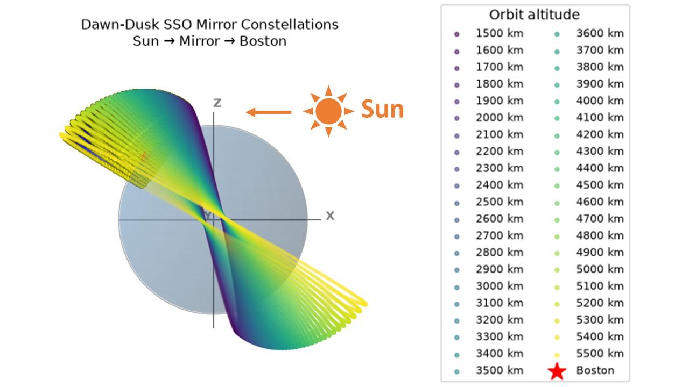
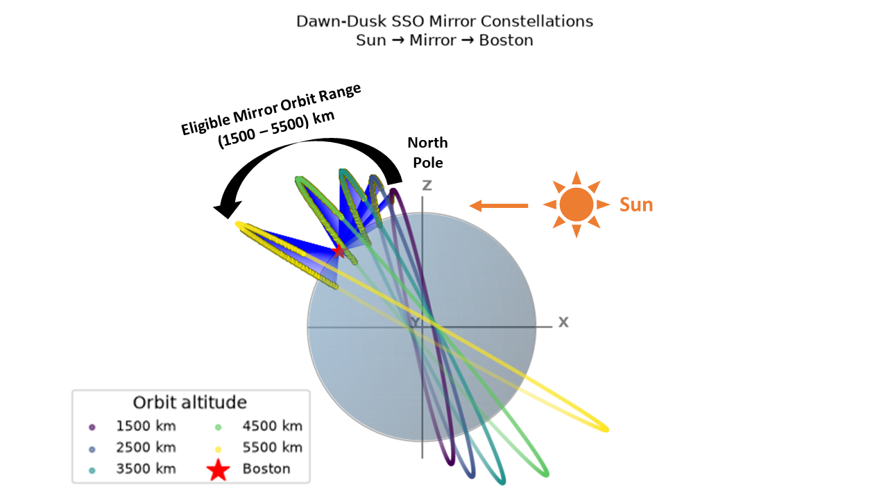
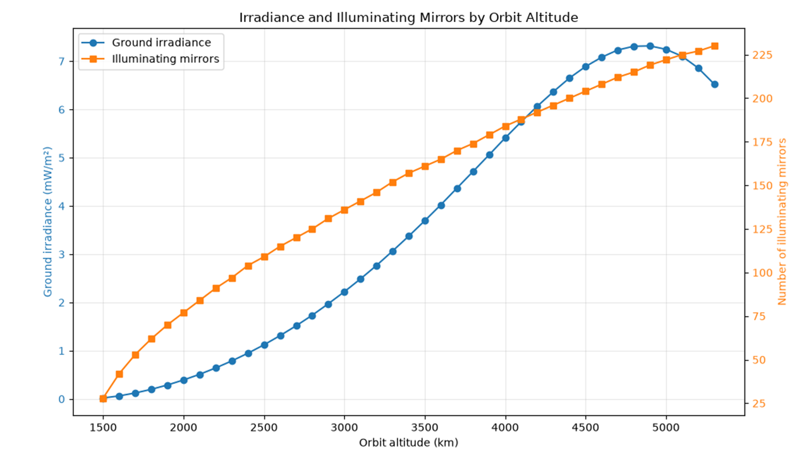
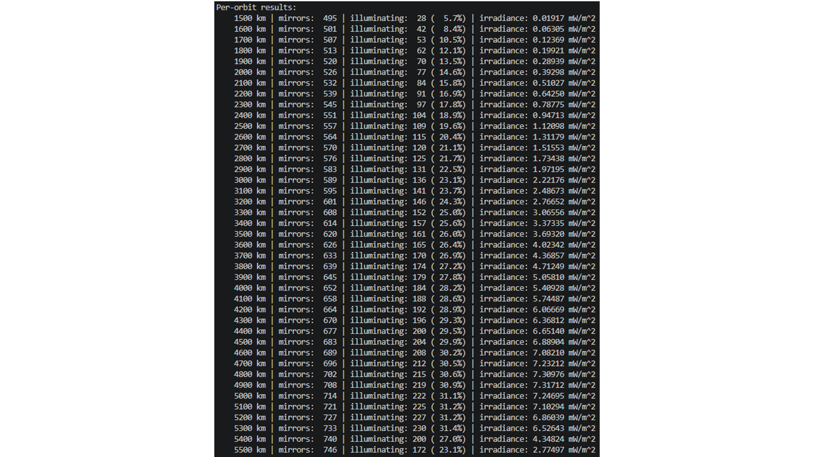

---
date:
  created: 2026-09-05
draft: False
categories: [Space Mirrors, Optics, Python]
---

# Can 25,000 Space Mirrors Really Light Up the Night?

In my previous three articles, I explored the idea of using space-based mirrors in a dawn-dusk Sun-synchronous orbit (SSO) to reflect sunlight toward a location on Earth.

- [How Many Space Mirrors Would It Take to Light Up Your Night?](https://optical-intelligence.github.io/home/blog/2026/08/16/how-many-space-mirrors-would-it-take-to-light-up-your-night/)
- [How Does a Space Mirror Light Up the Night? The Physics Behind the Simulation](https://optical-intelligence.github.io/home/blog/2026/08/22/how-does-a-space-mirror-light-up-the-night-the-physics-behind-the-simulation/)
- [Simulating a Space Mirror System with Python: Four Seasons Over Boston](https://optical-intelligence.github.io/home/blog/2026/08/30/simulating-a-space-mirror-system-with-python-four-seasons-over-boston/)

In the previous simulations, I modeled mirrors distributed along a single orbit.

This time, I asked a much bigger question:

> **What happens if we try to use the entire practical range of dawn-dusk SSO altitudes and populate multiple orbits with mirrors?**

The result was surprising.

Even after simulating **41 orbits containing more than 25,000 mirrors**, the total illumination reaching Boston was only about **0.04% of average daylight irradiance**.

This does not mean that space mirrors cannot illuminate the night. They clearly can. However, my simulation suggests that achieving anything close to daylight-level illumination using this particular orbital architecture may be much more difficult than simply launching a large number of mirrors.

<!-- more -->

---

## 1. From One Orbit to 41 Orbits



*Figure 1. Simulated dawn-dusk SSO mirror constellation extending from 1,500 km to 5,500 km altitude. Notice the inclination of each orbit increase with with increasing altitude.*

In the previous simulation, mirrors were distributed around a single dawn-dusk Sun-synchronous orbit. For this new simulation, I expanded the model to include multiple orbital altitudes.

### Multi-Orbit Simulation Summary

| Parameter | Value |
|---|---:|
| Number of orbital rings | 41 |
| Altitude range | 1,500–5,500 km |
| Altitude increment | 100 km |
| Mirror spacing | 100 km |
| Total mirrors | 25,429 |
| Mirrors illuminating Boston | 6,183 |
| Illuminating fraction | 24.3% |

---

## 2. Why 1,500 km to 5,500 km?



*Figure 1. For illuminating Boston, mirrors only works for orbits with altitude ranging from 1,500 km to 5,500 km.*

The altitude range was selected based on the constraints used in my simulation for a dawn-dusk Sun-synchronous orbit. Check the details of the simulation in this article: [How Does a Space Mirror Light Up the Night? The Physics Behind the Simulation](https://optical-intelligence.github.io/home/blog/2026/08/22/how-does-a-space-mirror-light-up-the-night-the-physics-behind-the-simulation/)

For obit altitude below approximately **1,500 km**, all the mirrors in these low orbits lack direct line-of-sight to Boston although sunlight can still reach each mirror.

At the other end of the altitude range (above **5,500 km**), the ability to maintain a dawn-dust Sun-synchronous orbit becomes increasingly constrained.

A Sun-synchronous orbit depends on Earth's oblateness, represented primarily by the J2 gravitational perturbation, to cause the orbital plane to precess at approximately the same rate as Earth's motion around the Sun.

At sufficiently high altitudes, the J2-induced nodal precession rate becomes insufficient to maintain the required dawn-dusk Sun-synchronous geometry.

Based on the assumptions and orbital model used in this simulation, I therefore limited the analysis to:

> **1,500 km to 5,500 km altitude**

It is important to emphasize that these boundaries are results and assumptions of my model and should not be interpreted as universal limits for every possible space-mirror architecture.

---

## 3. Simulaiton results

The result was a large three-dimensional orbital constellation containing a total of **25,429 Mirrors**.

Out of **25,429 mirrors**:

- **6,183 mirrors contributed illumination**
- **19,246 mirrors did not contribute**
- Only **24.3%** of the mirrors were geometrically useful for the target location (Boston in this case)

This highlights an important challenge for a large orbital mirror system. Simply placing more mirrors into orbit does not mean every mirror contributes useful light to a particular location.

For a mirror to contribute illumination, several geometric conditions must be satisfied:

1. The mirror must receive sunlight (which we have done so by placing the mirros in the dawn-dust SSO orbits so that most mirros has access to sunlight almost ~24 hours).
2. The target location must be visible from the mirror.
3. The reflected sunlight must be directed toward the target.
4. Earth's geometry and horizon constraints must permit the reflection.

The result is that a large fraction of an orbital mirror constellation may be unavailable for illuminating a particular location at any given time.



*Figure 3. Irradiance contribution from each simulated orbital altitude. The horizontal axis represents orbital altitude. The primary vertical axis shows irradiance contribution from that orbit, while the secondary vertical axis shows the number of illuminating mirrors.*

Figure 3 shows irradiance contribution and number of illuminating mirrors as a function of orbital altitude. As the orbital altitude increases, each orbit has a larger circumference and can therefore accommodate more mirrors with a fixed 100 km spacing. 

Consequently, higher-altitude orbits generally contain more mirrors and contribute a greater number of illuminating mirrors to the total illumination at Boston. However, the irradiance contribution does not continue increasing indefinitely with altitude. 

In this simulation, the irradiance contribution reaches its maximum at approximately 4,900 km altitude, after which it begins to decrease despite the increasing number of mirrors. 

This result suggests that the illumination efficiency is influenced not only by the number of mirrors, but also by the changing Sun–mirror–ground geometry at different orbital altitudes.

Here is a more detailed results with the total mirrors, the illuminating mirrors, and its contribution to the irradiance in each orbit: 



---

### Total Illumination Over Boston

After summing the contribution from the illuminating mirrors from all 41 orbits, the simulation produced a total irradiance at Boston of **148 mW/m²**

Using a reference full-moon irradiance of approximately **1 mW/m²**, this is equivalent to **148 Full Moons**

That initially sounds like a very large amount of light.

After all, 148 full moons would make the night dramatically brighter.

But the comparison changes when we compare the result with daylight (** ~ 350,000 mW/m²**).

The simulated irradiance corresponds to approximately **0.04% of Average Daylight Irradiance**

In other words:

> **Even a constellation containing more than 25,000 mirrors does not come close to reproducing normal daylight illumination in this simulation.**

## 4. The Scale and Cost Challenge

The simulation raises another question that cannot be answered by orbital mechanics alone:

> **Would such a system be economically practical?**

My simulation required more than **25,000 Individual Mirrors** in orbits to produce an illumination level equal to only **0.04% of Average Daylight**

A system with tens of thousands of space mirrors would potentially require:

- Manufacturing thousands of mirror platforms and its control and power units
- Launching them into multiple orbital configurations
- Maintaining their orbital configuration
- Tracking and controlling the constellation
- Managing collision and space-debris risks
- Replacing failed mirrors
- Eventually disposing of the system safely

All of this infrastructure would be required to provide relatively weak illumination over a limited ground area, based on the assumptions used in this simulation.

---

## 5. What Does This Mean for Space-Mirror Concepts?

The idea of using orbital reflectors to deliver sunlight to locations on Earth has recently received renewed attention.

One company publicly working on this concept is [Reflect Orbital](https://www.reflectorbital.com/).

The concept itself is scientifically interesting. Orbital mechanics, reflective surfaces, and solar illumination are all well-established areas of physics.

However, my independent simulation suggests that there may be a significant gap between demonstrating that a mirror in space can reflect sunlight toward Earth and building a system capable of producing useful large-scale illumination.

Those are two very different engineering problems.

A single mirror can demonstrate the basic physics.

A constellation of thousands or tens of thousands of mirrors introduces additional challenges involving:

- Constellation geometry
- Orbital mechanics
- Mirror pointing accuracy
- Illumination footprint
- Launch capacity
- Satellite reliability
- Space traffic management
- Economic viability

My simulation does not evaluate Reflect Orbital's proprietary technology, engineering design, business model, or internal performance claims.

Instead, it explores one particular implementation of a multi-orbit dawn-dusk SSO mirror constellation using my own assumptions and physics model.

Under those assumptions, the results suggest that achieving daylight-level illumination would require an extremely large orbital infrastructure.

---

## 6. My Takeaway

The most important conclusion from this simulation is not that space mirrors are impossible.

The simulation clearly demonstrates that a large mirror constellation can deliver measurable additional illumination to the ground.

The more difficult question is scale.

If a system containing:

- **41 orbital rings**
- **25,429 mirrors**
- **6,183 actively illuminating mirrors**

produces only:

- **148 mW/m²**
- **148 times full-moon irradiance**
- **Approximately 0.04% of average daylight**

then achieving something approaching daylight-level illumination may require either:

1. A dramatically larger constellation, or
2. A fundamentally different system architecture.

That is where the engineering and economic challenges become significant.

Based on my simulation, I currently find it difficult to see how a large dawn-dusk SSO mirror constellation could economically provide daylight-like illumination over a ground location using the assumptions tested here.

That does not prove that other approaches cannot work.

But it does suggest that the problem may be substantially harder than simply putting reflective mirrors into orbit.

---

## 7. Explore the Code Yourself

One of the reasons I made this project available as Python code is that the assumptions can be tested and modified.

The model can be used to investigate:

- Different orbital altitudes
- Different mirror spacing
- Larger or smaller mirrors
- Different reflectivity
- Different ground locations
- Different dates and seasons
- Different orbital architectures
- Different illumination targets

The results presented in this article are based on my own simulation assumptions and configuration.

Other assumptions or system designs may produce different results.

If you are interested in experimenting with the model yourself, the Python code is available here:

### 👉 [Get the Space Mirror Simulation Code](https://opticalpython.gumroad.com/l/multi_orbit)

Here is an example of the the main code, which needs the MirrorSSO_Class [here](https://opticalpython.gumroad.com/l/multi_orbit) to run: 

```python
# ============================================================
# Sunlight Reflection from Mirrors in Multiple Dawn-Dusk SSOs
# ============================================================

import math
import numpy as np
from skyfield.api import load

from MirrorSSO_Class import MirrorSSO


# ======================== CONFIGURATION ========================

# Boston, MA
LAT_DEG = 42
LON_DEG = -71

# Spring equinox 2025-03-20, 04:00 UTC (US Eastern Time 00:00)
SIMULATION_TIME = (2025, 3, 20, 4, 0, 0)

# Simulate one dawn-dusk SSO at each altitude in this range.
ORBIT_ALTITUDE_KM_ARR = np.arange(1500.0, 5301.0, 100.0)
EARTH_RADIUS_KM = 6371.0
MIRROR_SPACE_KM = 100.0
FULL_MOON_IRRADIANCE_MW_M2 = 1.0  # mW/m^2

def main():
    """Run the reflection calculation for every configured orbit altitude."""
    print("Loading Skyfield DE440...")
    ts = load.timescale()
    eph = load("de440s.bsp")

    earth = eph["earth"]
    sun = eph["sun"]
    t = ts.utc(*SIMULATION_TIME)

    print(f"\nTime: {t.utc_strftime('%Y-%m-%d %H:%M:%S UTC')}")
    sun_apparent = earth.at(t).observe(sun).apparent()
    sun_position = sun_apparent.xyz.km
    sun_ra, sun_dec, sun_distance = sun_apparent.radec()

    print("\nSun Parameters:")
    print(f"  RA       = {sun_ra}")
    print(f"  Dec      = {sun_dec}")
    print(f"  Distance = {sun_distance.au:.8f} AU")
    print("\nPer-orbit results:")

    total_mirrors = 0
    total_illuminating_mirrors = 0
    total_irradiance = 0.0
    orbit_results = []
    plot_simulation = None

    for altitude_km in ORBIT_ALTITUDE_KM_ARR:
        n_mirrors = round(
            2.0 * math.pi * (EARTH_RADIUS_KM + altitude_km) / MIRROR_SPACE_KM
        )
        simulation = MirrorSSO(
            n_mirrors=n_mirrors,
            orbit_altitude_km=altitude_km,
            mirror_side_m=18.0,
            mirror_reflectivity=0.90,
            solar_irradiance_1au=1361.0,
            sun_angular_diameter_rad=9.3e-3,
            visible_fraction=0.46,
            atmospheric_transmission=0.80,
            ltan_hours=6.0,
        )

        inclination_deg = simulation.sso_inclination_deg(altitude_km)
        raan_rad = simulation.dawn_dusk_raan(sun_position)
        mirrors = simulation.generate_mirrors(
            simulation.N_MIRRORS, altitude_km, inclination_deg, raan_rad
        )
        irradiance, illuminating_mirrors, non_illuminating_mirrors = (
            simulation.calculate_irradiance_at_point(
                t, LAT_DEG, LON_DEG, mirrors, sun_position
            )
        )

        illuminating_count = len(illuminating_mirrors)
        illuminating_percent = 100.0 * illuminating_count / simulation.N_MIRRORS
        print(
            f"  {altitude_km:6.0f} km | "
            f"mirrors: {simulation.N_MIRRORS:4d} | "
            f"illuminating: {illuminating_count:3d} "
            f"({illuminating_percent:5.1f}%) | "
            f"irradiance: {irradiance * 1000:.5f} mW/m^2"
        )

        total_mirrors += simulation.N_MIRRORS
        total_illuminating_mirrors += illuminating_count
        total_irradiance += irradiance
        orbit_results.append({
            "altitude_km": altitude_km,
            "irradiance_w_m2": irradiance,
            "mirrors": mirrors,
            "illuminating_mirrors": illuminating_mirrors,
            "non_illuminating_mirrors": non_illuminating_mirrors,
            "time": t,
        })
        plot_simulation = simulation

    total_illuminating_percent = 100.0 * total_illuminating_mirrors / total_mirrors
    print("\nFinal Irradiance Results:")
    print(f"  Number of Orbits           = {len(orbit_results)}")
    print(f"  Total Mirrors in Orbits    = {total_mirrors}")
    print(
        f"  Illuminating Mirrors       = {total_illuminating_mirrors} "
        f"({total_illuminating_percent:.1f}%)"
    )
    print(f"  Total Ground Irradiance    = {total_irradiance * 1000:.5f} mW/m^2")
    print(
        f"  Fraction of Full Moon  = "
        f"{total_irradiance * 1000 / FULL_MOON_IRRADIANCE_MW_M2:.4f}"
    )
    print("=" * 65)

    simulation.plot_multi_orbit_results(plot_simulation, orbit_results, LAT_DEG, LON_DEG)
    simulation.plot_altitude_results(orbit_results)


if __name__ == "__main__":
    main()

```
---

## 8. Final Thoughts

This multi-orbit simulation significantly expanded the scale of my previous simulation.

Instead of asking whether one orbital ring of mirrors can illuminate Boston, I simulated the practical altitude range of a dawn-dusk SSO architecture using 41 separate orbital rings.

The result was a constellation of more than **25,000 mirrors**.

Yet only about one-quarter of those mirrors were able to contribute illumination to Boston under the simulated conditions, and the final illumination remained extremely small compared with normal daylight.

For me, this is the most interesting result of the simulation.

The physics of reflecting sunlight from space is relatively straightforward.

The challenge appears when trying to scale that physics into a practical, large-scale orbital system.

A space mirror can reflect sunlight.

Thousands of space mirrors can make the night brighter.

But based on this simulation, achieving daylight-like illumination from a dawn-dusk SSO mirror constellation may require an enormous amount of orbital infrastructure.

Whether such a system can ultimately become technically and economically practical remains an open engineering question.